# 开发任务约束
以下规则主要是你在接收到任何提示词时,根据这个约束检查开发状况和规则遵守情况, 并辅助纠正开发规范偏移,共同改善开发质量.  
当开发者的提示词包含以下任一任务编号时, 请根据以下规则检查开发状况和规则遵守情况, 并辅助纠正开发规范偏移, 共同改善开发质量.
例如: 当你接收到一个提示词,但是没有对应的需求范围定义文档内容, 请检查是否有编写@Docs/PRD-Featurename.md或PRD-Projectname.md且包含足够明确的需求范围定义,如果没有,任务未完成, 发出警告内容, 不建议继续.

## 规范任务清单

  
任务的先后顺序
```json
 { "任务类型": "需求分析", "任务列表": [ { "任务编号": "REQ-01", "任务描述": "需求范围定义", "前置任务": "无", "后置任务": "REQ-02" }, { "任务编号": "REQ-02", "任务描述": "需求接口定义", "前置任务": "REQ-01", "后置任务": "REQ-03" }, { "任务编号": "REQ-03", "任务描述": "需求边界条件", "前置任务": "REQ-02", "后置任务": "REQ-04" }, { "任务编号": "REQ-04", "任务描述": "需求场景描述", "前置任务": "REQ-03", "后置任务": "REQ-05" }, { "任务编号": "REQ-05", "任务描述": "需求文档化", "前置任务": "REQ-04", "后置任务": "DES-01" } ] }, { "任务类型": "设计阶段", "任务列表": [ { "任务编号": "DES-01", "任务描述": "数据流设计", "前置任务": "REQ-05", "后置任务": "DES-02" }, { "任务编号": "DES-02", "任务描述": "数据结构设计", "前置任务": "DES-01", "后置任务": "DES-03" }, { "任务编号": "DES-03", "任务描述": "状态机设计", "前置任务": "DES-02", "后置任务": "DES-04" }, { "任务编号": "DES-04", "任务描述": "模块化设计", "前置任务": "DES-03", "后置任务": "DES-05" }, { "任务编号": "DES-05", "任务描述": "接口契约设计", "前置任务": "DES-04", "后置任务": "DES-06" }, { "任务编号": "DES-06", "任务描述": "依赖注入设计", "前置任务": "DES-05", "后置任务": "DES-07" }, { "任务编号": "DES-07", "任务描述": "配置管理设计", "前置任务": "DES-06", "后置任务": "DES-08" }, { "任务编号": "DES-08", "任务描述": "错误处理设计", "前置任务": "DES-07", "后置任务": "DES-09" }, { "任务编号": "DES-09", "任务描述": "监控点设计", "前置任务": "DES-08", "后置任务": "TEST-DES-01" } ] }, { "任务类型": "测试设计", "任务列表": [ { "任务编号": "TEST-DES-01", "任务描述": "单元测试设计", "前置任务": "DES-09", "后置任务": "DES-INTG-TEST" }, { "任务编号": "DES-INTG-TEST", "任务描述": "集成测试设计", "前置任务": "TEST-DES-01", "后置任务": "DES-MOCK-TEST" }, { "任务编号": "DES-MOCK-TEST", "任务描述": "模拟对象设计", "前置任务": "DES-INTG-TEST", "后置任务": "DES-AUTO-TEST" }, { "任务编号": "DES-AUTO-TEST", "任务描述": "自动化测试设计", "前置任务": "DES-MOCK-TEST", "后置任务": "DEV-01" } ] }, { "任务类型": "开发实现", "任务列表": [ { "任务编号": "DEV-01", "任务描述": "核心框架搭建", "前置任务": "DES-AUTO-TEST", "后置任务": "DEV-02" }, { "任务编号": "DEV-02", "任务描述": "状态管理实现", "前置任务": "DEV-01", "后置任务": "DEV-03" }, { "任务编号": "DEV-03", "任务描述": "通信模块实现", "前置任务": "DEV-02", "后置任务": "DEV-04" }, { "任务编号": "DEV-04", "任务描述": "业务逻辑实现", "前置任务": "DEV-03", "后置任务": "DEV-05" }, { "任务编号": "DEV-05", "任务描述": "配置模块实现", "前置任务": "DEV-04", "后置任务": "DEV-06" }, { "任务编号": "DEV-06", "任务描述": "监控模块实现", "前置任务": "DEV-05", "后置任务": "DEV-07" }, { "任务编号": "DEV-07", "任务描述": "单元测试开发", "前置任务": "DEV-06", "后置任务": "DEV-08" }, { "任务编号": "DEV-08", "任务描述": "集成测试开发", "前置任务": "DEV-07", "后置任务": "REV-01" } ] }, { "任务类型": "代码评审", "任务列表": [ { "任务编号": "REV-01", "任务描述": "代码风格检查", "前置任务": "DEV-08", "后置任务": "REV-02" }, { "任务编号": "REV-02", "任务描述": "内聚耦合评估", "前置任务": "REV-01", "后置任务": "REV-03" }, { "任务编号": "REV-03", "任务描述": "错误处理检查", "前置任务": "REV-02", "后置任务": "REV-04" }, { "任务编号": "REV-04", "任务描述": "性能资源评估", "前置任务": "REV-03", "后置任务": "TEST-01" } ] }, { "任务类型": "测试执行", "任务列表": [ { "任务编号": "TEST-01", "任务描述": "单元测试执行", "前置任务": "REV-04", "后置任务": "TEST-02" }, { "任务编号": "TEST-02", "任务描述": "测试覆盖评估", "前置任务": "TEST-01", "后置任务": "TEST-03" }, { "任务编号": "TEST-03", "任务描述": "集成测试执行", "前置任务": "TEST-02", "后置任务": "TEST-04" }, { "任务编号": "TEST-04", "任务描述": "性能测试执行", "前置任务": "TEST-03", "后置任务": "TEST-05" }, { "任务编号": "TEST-05", "任务描述": "异常测试执行", "前置任务": "TEST-04", "后置任务": "DOC-01" } ] }, { "任务类型": "文档编写", "任务列表": [ { "任务编号": "DOC-01", "任务描述": "API文档更新", "前置任务": "TEST-05", "后置任务": "DOC-02" }, { "任务编号": "DOC-02", "任务描述": "使用说明编写", "前置任务": "DOC-01", "后置任务": "DOC-03" }, { "任务编号": "DOC-03", "任务描述": "开发日志更新", "前置任务": "DOC-02", "后置任务": "DEPLOY-01" } ] }, { "任务类型": "部署发布", "任务列表": [ { "任务编号": "DEPLOY-01", "任务描述": "配置检查", "前置任务": "DOC-03", "后置任务": "DEPLOY-03" }, { "任务编号": "DEPLOY-02", "任务描述": "依赖检查", "前置任务": "DEPLOY-01", "后置任务": "DEPLOY-03" }, { "任务编号": "DEPLOY-03", "任务描述": "临时文件清理", "前置任务": "DEPLOY-2", "后置任务": "DEPLOY-04" }, { "任务编号": "DEPLOY-04", "任务描述": "部署脚本准备", "前置任务": "DEPLOY-03", "后置任务": "RELEASE" }, { "任务编号": "RELEASE", "任务描述": "版本发布", "前置任务": "DEPLOY-04", "后置任务": "MAINT-01" }, { "任务编号": "MAINT-01", "任务描述": "技术债务记录", "前置任务": "RELEASE", "后置任务": "无" } ] } 
```

## 硬性规则
1. 禁止在未完成REQ阶段直接开始编码
2. 禁止未经单元测试的代码合并到主分支
3. 禁止硬编码配置参数，必须使用配置文件或Redis
4. 每个Feature类必须有对应的测试类
5. 所有依赖必须通过构造函数注入，不允许内部实例化
6. 代码变更必须同步更新相关文档
7. 所有异常必须被捕获并记录日志
8. 每次开发交互必须引用对应的任务编号

## 视觉规范
- 警告: 背景色：#FFF3CD（黄色警告色），边框红色，显眼但不阻断编辑。图标：⚠️
- 提示: 背景色：#D1FADF（绿色提示色），边框绿色，不显眼，不影响编辑。图标：💡
- 严重: 背景色：#F8D7DA（红色错误色），边框红色，阻断编辑。图标：❌

## 完成状态的标注(示例)
```
REQ-01 需求范围定义
✅ **完成状态**：[door_out_ev_process]REQ-01完成
📌 **验证点**：
- 功能边界是否明确: 已包含出口门禁控制的触发条件、状态监控逻辑
- 输出指令格式是否定义清晰: 已定义开门命令的协议字段
- 数据记录需求是否完整: 已包含车辆信息、事件时间戳
```

## 未完成的状态(示例)
```
REQ-01 需求范围定义
✅ **完成状态**：[door_out_ev_process]REQ-01
📌 **验证点**：
- 功能边界是否明确:
- 输出指令格式是否定义清晰:
- 数据记录需求是否完整:
```

## 开发流程图

```mermaid
graph TD
    REQ01[REQ-01需求范围定义] --> REQ02[REQ-02需求接口定义]
    REQ02 --> REQ03[REQ-03需求边界条件]
    REQ03 --> REQ04[REQ-04需求场景描述]
    REQ04 --> REQ05[REQ-05需求文档化]
    REQ05 --> DES01[DES-01数据流设计]
    DES01 --> DES02[DES-02数据结构设计]
    DES02 --> DES03[DES-03状态机设计]
    DES03 --> DES04[DES-04模块化设计]
    DES04 --> DES05[DES-05接口契约设计]
    DES05 --> DES06[DES-06依赖注入设计]
    DES06 --> DES07[DES-07配置管理设计]
    DES07 --> DES08[DES-08错误处理设计]
    DES08 --> DES09[DES-09监控点设计]
    DES09 --> DESUNITTEST[DES-UNIT-TEST单元测试设计]
    DESUNITTEST --> DESINTGTEST[DES-INTG-TEST集成测试设计]
    DESINTGTEST --> DESMOCKTEST[DES-MOCK-TEST模拟对象设计]
    DESMOCKTEST --> DESAUTOTEST[DES-AUTO-TEST自动化测试设计]
    DESAUTOTEST --> DEV01[DEV-01核心框架搭建]
    DEV01 --> DEV02[DEV-02状态管理实现]
    DEV02 --> DEV03[DEV-03通信模块实现]
    DEV03 --> DEV04[DEV-04业务逻辑实现]
    DEV04 --> DEV05[DEV-05配置模块实现]
    DEV05 --> DEV06[DEV-06监控模块实现]
    DEV06 --> DEV07[DEV-07单元测试开发]
    DEV07 --> DEV08[DEV-08集成测试开发]
    DEV08 --> REV01[REV-01代码风格检查]
    REV01 --> REV02[REV-02内聚耦合评估]
    REV02 --> REV03[REV-03错误处理检查]
    REV03 --> REV04[REV-04性能资源评估]
    REV04 --> TEST01[TEST-01单元测试执行]
    TEST01 --> TEST02[TEST-02测试覆盖评估]
    TEST02 --> TEST03[TEST-03集成测试执行]
    TEST03 --> TEST04[TEST-04性能测试执行]
    TEST04 --> TEST05[TEST-05异常测试执行]
    TEST05 --> DOC01[DOC-01API文档更新]
    DOC01 --> DOC02[DOC-02使用说明编写]
    DOC02 --> DOC03[DOC-03开发日志更新]
    DOC03 --> DOC04[DOC-04变更日志更新]
    DOC04 --> DEPLOY01[DEPLOY-01配置检查]
    DEPLOY01 --> DEPLOY02[DEPLOY-02依赖检查]
    DEPLOY02 --> DEPLOY03[DEPLOY-03临时文件清理]
    DEPLOY03 --> DEPLOY04[DEPLOY-04部署脚本准备]
    DEPLOY04 --> RELEASE[RELEASE版本发布]
    RELEASE --> MAINT01[MAINT-01技术债务记录]
```


## 异常阻断机制

示例:**ERR-REQ-01** 给出警告提示, 提醒开发未遵循流程规范：需求阶段（REQ-01至REQ-05）尚未完成，不建议开始编码。请完成需求文档后再继续。  

| 异常编号 | 触发条件 | 异常提示与指导 |
|---------|---------|--------------|
| **ERR-REQ-01** | 需求阶段未完成，直接进入编码 | 开发未遵循流程规范：需求阶段（REQ-01至REQ-05）尚未完成，不建议开始编码。请完成需求文档后再继续。 |
| **ERR-REQ-02** | 接口定义不明确或不完整 | 接口定义不完整：请明确定义所有输入/输出接口，包括参数类型、格式和有效范围。 |
| **ERR-REQ-03** | 需求边界条件未定义 | 边界条件缺失：请定义功能的边界条件和异常处理情况，避免后期开发中出现未考虑的场景。 |
| **ERR-DES-01** | 数据流设计不清晰或不完整 | 数据流设计不完整：缺少数据源或目标定义，无法确定数据流向。请先完成DES-01任务再继续。 |
| **ERR-DES-02** | 数据结构设计不清晰或类型未定义 | 数据结构设计不明确：请明确定义数据类型、结构和格式，完成DES-02任务。 |
| **ERR-DES-03** | 状态机设计缺失或状态转换不明确 | 状态机定义不完整：请明确所有可能的状态及转换条件，完成DES-03任务。 |
| **ERR-DES-04** | 模块划分不合理或职责不清晰 | 模块化设计不合理：功能职责划分不清晰，请重新评估模块边界，遵循高内聚低耦合原则。 |
| **ERR-DES-05** | 接口契约未定义或参数不明确 | 接口契约缺失：模块间交互接口未明确定义，请完成接口参数、返回值和异常定义。 |
| **ERR-CODE-01** | 硬编码配置参数 | 违反硬编码规则：检测到硬编码配置值。所有配置必须从Redis或配置文件读取，不允许在代码中硬编码。 |
| **ERR-CODE-02** | 内部直接实例化依赖 | 违反依赖注入原则：组件内部直接实例化依赖。请通过构造函数注入所有依赖。 |
| **ERR-CODE-03** | 未捕获的异常或日志记录不完整 | 异常处理不完整：检测到未捕获的异常或缺少日志记录。所有异常必须被捕获并记录。 |
| **ERR-CODE-04** | Feature类缺少对应的测试类 | 测试类缺失：每个Feature类必须有对应的测试类。请为当前Feature类创建测试类。 |
| **ERR-TEST-01** | 测试覆盖率低于85% | 测试覆盖率不足：当前测试覆盖率低于85%的要求。请添加更多测试用例提高覆盖率。 |
| **ERR-TEST-02** | 集成测试未覆盖关键场景 | 集成测试不完整：未覆盖关键集成场景。请确保所有模块交互点都有对应的测试用例。 |
| **ERR-DOC-01** | 代码变更未同步更新文档 | 文档同步缺失：代码变更未反映在相关文档中。请更新对应文档以保持一致性。 |
| **ERR-DEPLOY-01** | 部署缺少必要的配置文件 | 配置文件缺失：部署缺少必要的配置文件。请确保所有配置文件齐全并验证其正确性。 |
| **ERR-DEPLOY-02** | 发布包含调试代码或临时文件 | 临时文件残留：发布包含调试代码或临时文件。请清理所有非必要文件后再发布。 |
| **ERR-COMM-01** | 开发交互未引用任务编号 | 任务编号缺失：开发交互必须引用对应的任务编号，以便跟踪进度和确保流程规范。 |
| **ERR-COMM-02** | 需求变更未经评估直接实施 | 需求变更未评估：检测到需求变更未经影响评估直接实施。请先评估变更影响范围后再实施。 |
| **ERR-ARCH-01** | 违反模块化原则，出现循环依赖 | 循环依赖检测：发现模块间存在循环依赖，违反模块化设计原则。请重构代码消除循环依赖。 |
| **ERR-ARCH-02** | 核心业务与技术实现未分离 | 关注点未分离：业务逻辑与技术实现耦合。请重构代码，将业务规则与技术实现分离。 |
| **ERR-PERF-01** | 性能测试未达到指标要求 | 性能不达标：性能测试结果未达到指标要求。请优化关键路径代码提升性能。 |
| **ERR-MAINT-01** | 技术债务项目积累过多 | 技术债务过多：当前积累的技术债务超过阈值。请安排时间清理技术债务，避免影响开发进度。 |
